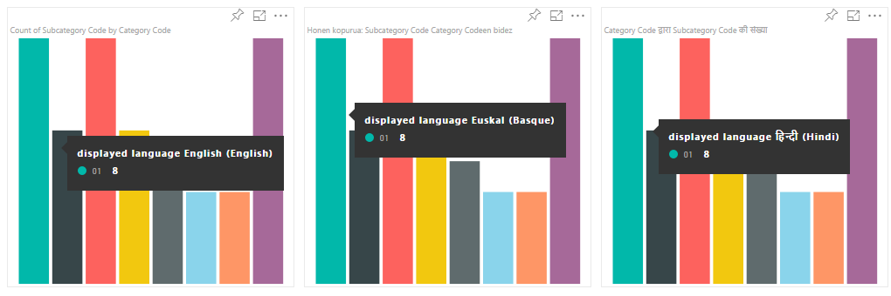

# Localizing your Custom Visuals 

Visuals can now know PowerBI's locale, so they can display localized information
(read more about [Supported languages and countries/regions for Power BI](https://powerbi.microsoft.com/en-us/documentation/powerbi-supported-languages/)).<br>
The `locale` string is passed on `IVisualHost`.

See [commit](https://github.com/Microsoft/PowerBI-visuals-sampleBarChart/commit/388670c71a873bf7412e771164ea3cbb8522a63e) for what was added at this step.

## Localizing the tooltips

In the sample we display the current locale in the tooltip.



Each of these bar charts was created under different locale (English, Basque and Hindi).

The BarChart contructor now has a `locale` member which is instantiated in the constructor with the host `locale` instance.

```typescript
    private locale: string;
    ...
    this.locale = options.host.locale;
```

A `LocalizaionResources` interface was added, which helps in localizing strings. It defines the required string for each locale, and also the 'defaultValue', which will be displayed if the visual wansn't adapted to this locale.<br>
`myResources` is an instance of this interface, which holds the localized strings:

```typescript
module powerbi.extensibility.visual {

    export var myResources: Resources = {};
    myResources["LanguageKey"] = {
        defaultValue: "English(English)",
        localization: {
            "ar-SA": "العربية (Arabic)",
            "bg-BG": "български (Bulgarian)",
            ...,
            "zh-CN": "中国 (Chinese-Simplified)",
            "zh-TW": "中國 (Chinese-Tranditional)"
        }
    };

}
```
Getting a localized string is easy using `getLocalizedString`.
```typescript
    /**
     * Returns the localized string in the locale transfared using the key that was given to serch the resources
     * 
     * @param {string} locale - the locale in which PowerBI is currently running
     * @param {object} key - specify a key for the string you want localized in your visual
     */   
    export function getLocalizedString(locale: string, key: string): string {
        return myResources && key && myResources[key] && (((myResources[key]).localization[locale])|| (myResources[key]).defaultValue);
   }
```

The data for the tooltip is than derived from the current `locale`:

```typescript
private getTooltipData(value: any): VisualTooltipDataItem[] {
    let language = getLocalizedString(this.locale,"LanguageKey");
    return [{
        displayName: value.category,
        value: value.value.toString(),
        color: value.color,
        header: language && "displayed language " + language
    }];
}
```
